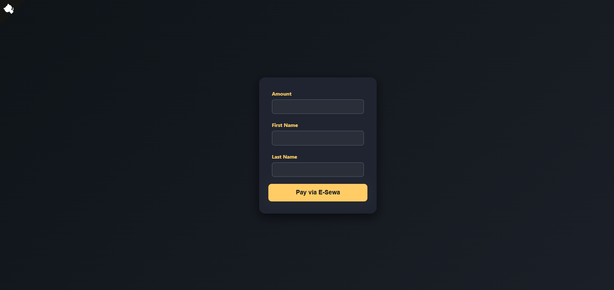
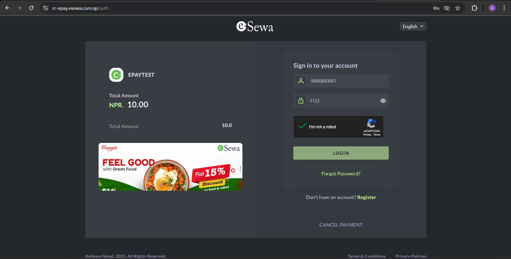
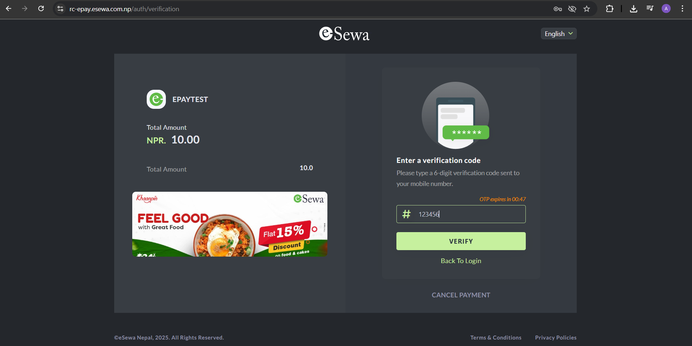

# eSewa Integration Guide (React) 💸

<p align="center">
  <a href="https://github.com/AmanRai8/Esewa-integration/stargazers">
    
  </a>
  <a href="https://github.com/AmanRai8/Esewa-integration/network/members">
    
  </a>
  
  
</p>

> Demo project showing **eSewa payment gateway integration in React**.  
> ⚠️ **For educational/demo purposes only — no real transactions.**

---

## 📑 Table of Contents

- [What is eSewa?](#1-what-is-esewa)
- [Merchant Account Setup](#2-merchant-account-setup-🏦)
- [Integration Flow](#3-integration-flow-🔗)
- [React Example](#4-react-example-💻)
- [Test Credentials for Sandbox](#5-test-credentials-for-sandbox)
- [How to Run](#6-how-to-run-🚀)
- [Resources](#7-resources-📚)
- [Back to Top](#esewa-integration-guide-react-💸)

---

## 1. What is eSewa?

eSewa is Nepal’s leading digital wallet and payment gateway.  
Businesses can accept online payments using a **merchant account**.

---

## 2. Merchant Account Setup 🏦

### Required Documents

- PAN/VAT certificate
- Company registration certificate
- Citizenship of directors/owners
- Bank account details

📧 Email: `merchant@esewa.com.np`  
☎️ Toll-free: `01-5970123`  
🌐 [eSewa Official](https://esewa.com.np/)

---

## 3. Integration Flow 🔗

1. User selects **eSewa** as payment option.
2. Redirect to eSewa login page.
3. User logs in and confirms payment.
4. Redirect back to **success/failure URL**.
5. eSewa sends **IPN** notification.
6. Optional: verify transaction using **eSewa API**.

---

## 4. React Example 💻

### `EsewaForm.jsx`

```jsx
export default function EsewaForm() {
  return (
    <form
      action="https://uat.esewa.com.np/epay/main"
      method="POST"
      className="space-y-4 bg-gray-900 p-6 rounded-xl shadow-lg"
    >
      <input type="hidden" name="amt" value="100" />
      <input type="hidden" name="psc" value="0" />
      <input type="hidden" name="pdc" value="0" />
      <input type="hidden" name="txAmt" value="0" />
      <input type="hidden" name="tAmt" value="100" />
      <input type="hidden" name="pid" value="TEST_PRODUCT_001" />
      <input type="hidden" name="scd" value="TEST_MERCHANT" />
      <input type="hidden" name="su" value="http://localhost:5173/success" />
      <input type="hidden" name="fu" value="http://localhost:5173/failure" />

      <button
        type="submit"
        className="bg-green-500 text-white px-6 py-3 rounded-lg font-bold animate-pulse hover:scale-105 transition"
      >
        Pay with eSewa
      </button>
    </form>
  );
}
```

### Payment Form



## 5. Test Credentials for Sandbox 🧪

Use these **demo credentials** to test the integration:

| Field    | Value                                                      |
| -------- | ---------------------------------------------------------- |
| eSewa ID | 9806800001, 9806800002, 9806800003, 9806800004, 9806800005 |
| Password | Nepal@123                                                  |
| MPIN     | 1122                                                       |
| Token    | 123456                                                     |

> ⚠️ Only for **sandbox testing**. Not for production.

### Payment Form



- _Using `9806800001` as ID and `1122` as MPIN_



- _Using `123456` as verification token_

---

## 6. How to Run 🚀

```bash
git clone https://github.com/your-username/esewa-integration-guide-react.git
cd esewa-integration-guide-react
```

Install dependencies:

```bash
npm install
```

Start the development server:

```bash
npm run dev
```

Open `http://localhost:5173` in your browser.<br/>
Fill in the form and click Pay with eSewa to test the integration in sandbox mode.

## 7. Resources 📚

- [eSewa Official Website](https://esewa.com.np/)
- [eSewa Developer Docs](https://developer.esewa.com.np/pages/Epay#integration)

---

[⬆️ Back to Top](#esewa-integration-guide-react-💸)
